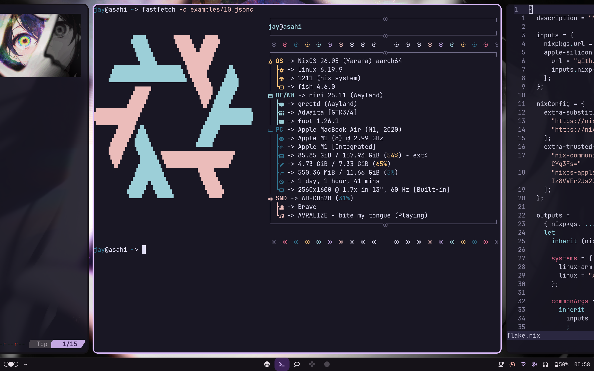

# Dotfiles

My configuration files for Niri, Neovim, etc.

Most programs are themed with [matugen](https://github.com/InioX/matugen) and have a default theme applied already. Check [the templates](./matugen/.config/matugen/templates/) for the complete list. To update the theme for all apps, use `matugen image <pathtoimage>`.

## Screenshot (may be outdated)



## Usage

- Clone the repo and cd into it:

```bash
git clone https://github.com/jaycem-dev/dotfiles.git ~/dev/dotfiles && cd ~/dev/dotfiles
```

- Symlink modules with stow:

```bash
# All packages
stow */

# Specific package
stow nvim
```
